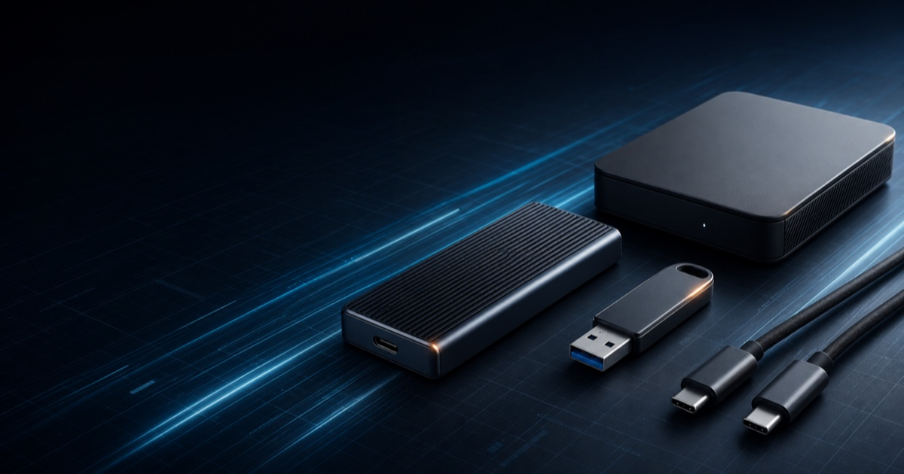
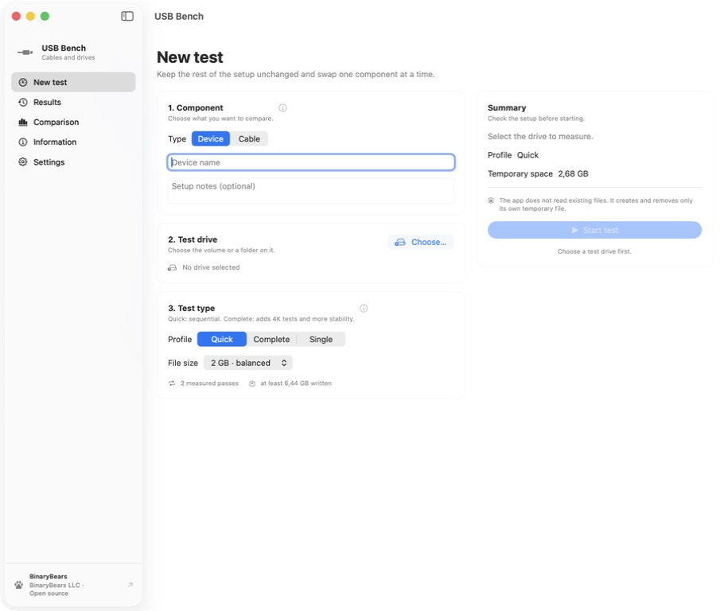

<div align="center">
  

  <h1>USB Bench</h1>

  <p><strong>Find the real bottleneck in your USB storage setup.</strong></p>

  <p>
    A native, open-source macOS benchmark for USB SSDs, HDDs, flash drives,
    cables, hubs, enclosures, and ports.
  </p>

  <p>
    <a href="https://github.com/BinaryBearsLLC/USB-Bench/actions/workflows/ci.yml"></a>
    <a href="LICENSE"></a>
    
    
    
  </p>

  <p>
    <a href="https://binarybearsllc.github.io/USB-Bench/">Website</a>
    ·
    <a href="https://github.com/BinaryBearsLLC/USB-Bench/releases">Releases</a>
    ·
    <a href="docs/DEVELOPMENT.md">Development</a>
    ·
    <a href="CONTRIBUTING.md">Contributing</a>
  </p>

  
</div>

## Measure the complete USB chain

A fast drive can be limited by a cable, hub, enclosure, port, or negotiated
connection speed. USB Bench records the benchmark result together with the
setup that produced it, making comparisons useful instead of ambiguous.

<p align="center">
  
</p>

### What you can benchmark

| Target | Keep constant | Learn |
| --- | --- | --- |
| External SSD, HDD, or flash drive | Cable, port, profile, and file size | Real storage performance |
| USB cable | Fast reference SSD, port, profile, and file size | Whether the cable limits throughput |
| Hub or enclosure | Reference drive, cable, port, and profile | The accessory's practical ceiling |
| Mac port | Reference drive, cable, and profile | Negotiated link and port-level differences |

## Results with context

- Quick, complete, and single-operation benchmark profiles.
- Sequential read and write measurements with `F_NOCACHE`.
- Separate transfer and durable-write timing, including drive synchronization.
- 4K random read and write measurements in the complete profile.
- Data-integrity verification outside the timed read measurement.
- Negotiated USB-link, hub path, free-space, filesystem, and device metadata.
- Device and cable modes with an explicit reference component.
- Guided comparisons that flag mismatched test setups.
- Local SQLite history, recoverable Trash, and CSV export.

## Safety by design

USB Bench does not format, unmount, or access raw disks. Each benchmark creates
one uniquely named `.usbbench-<UUID>.tmp` file inside the selected directory.
The engine removes only that file when the test completes, fails, or is
cancelled. Existing files are never opened, read, modified, or deleted.

The automated test suite uses isolated temporary directories and a sentinel
file to enforce this boundary.

## Private and local

Results remain in:

```text
~/Library/Application Support/USB Bench/results.sqlite3
```

There is no telemetry, analytics SDK, account system, advertising, or cloud
dependency. The interface is English-first and includes Italian localization.

## Requirements

- macOS 14 or later
- Apple Silicon Mac
- Xcode with Swift 6 or later for development
- Apple Developer Program membership only for official Developer ID releases

## Build and verify

```sh
./scripts/check_all.sh
```

The quality gate checks formatting, tests, assets, packaging, and the generated
DMG. Local packages are ad-hoc signed and are appropriate for validation only.
Official downloads are created only by the manually triggered release workflow
from a signed tag, then Developer ID signed, notarized by Apple, stapled, and
verified before publication.

See the [development guide](docs/DEVELOPMENT.md) for the toolchain and project
structure, and the [release guide](docs/RELEASE.md) for the full signing and
notarization procedure.

## Architecture

```text
Sources/USBBenchApp/       SwiftUI application and localization
Sources/USBBenchCore/      benchmark engine, models, SQLite, system inspection
Sources/USBBenchProbe/     command-line diagnostics
Tests/                     non-destructive automated tests
Packaging/                 application bundle metadata and icon configuration
Assets/                    canonical PNG project identity and application icon
scripts/                   build, verification, signing, and notarization
docs/                      development guide, release guide, and landing page
.github/workflows/         CI, GitHub Pages, and notarized release automation
```

## Contributing and security

Contributions are welcome. Read [CONTRIBUTING.md](CONTRIBUTING.md) before
opening a pull request. Report vulnerabilities through the process documented
in [SECURITY.md](SECURITY.md).

Notable changes are tracked in [CHANGELOG.md](CHANGELOG.md).

## License

Copyright © 2026 BinaryBears LLC.

The source code is licensed under the [MIT License](LICENSE). The USB Bench and
BinaryBears names and logos are not granted as trademarks by that license.
